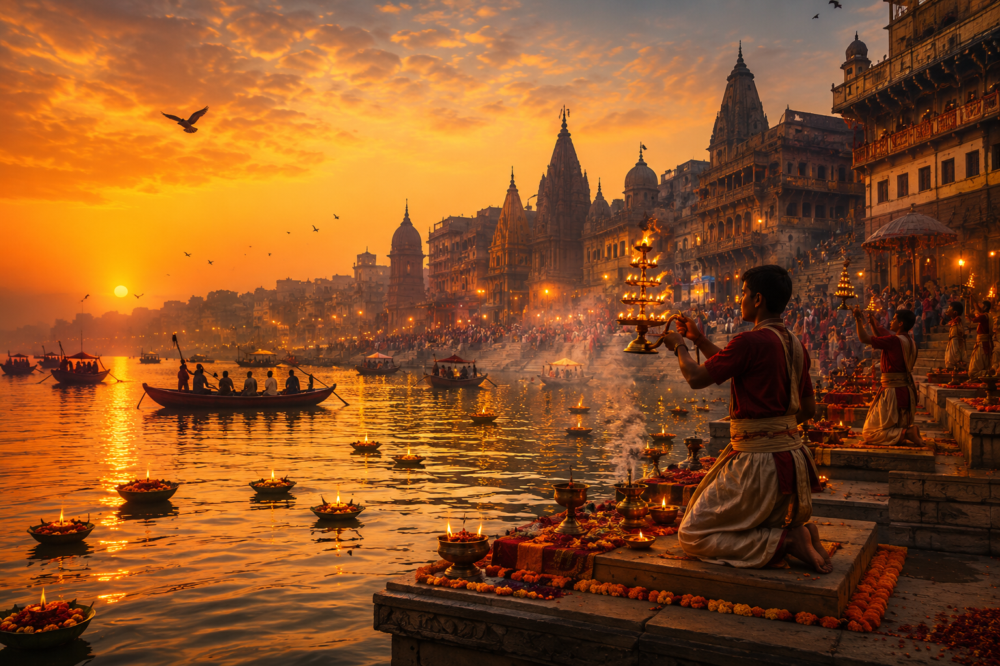

# Which State Am I? – Mini Challenge 2

## Concept
This image captures the spiritual and cultural essence of a region through rituals, river life, and traditional architecture — without directly naming it.

## Prompt
A cinematic, ultra-detailed riverside ritual scene at sunrise, glowing diyas floating on water, priests performing aarti, ancient stone steps filled with people in traditional attire, warm golden light, temple architecture in background, marigold decorations, misty spiritual atmosphere, highly realistic, 4k

## Tools Used
- DALL·E / AI Image Generator

## Output

